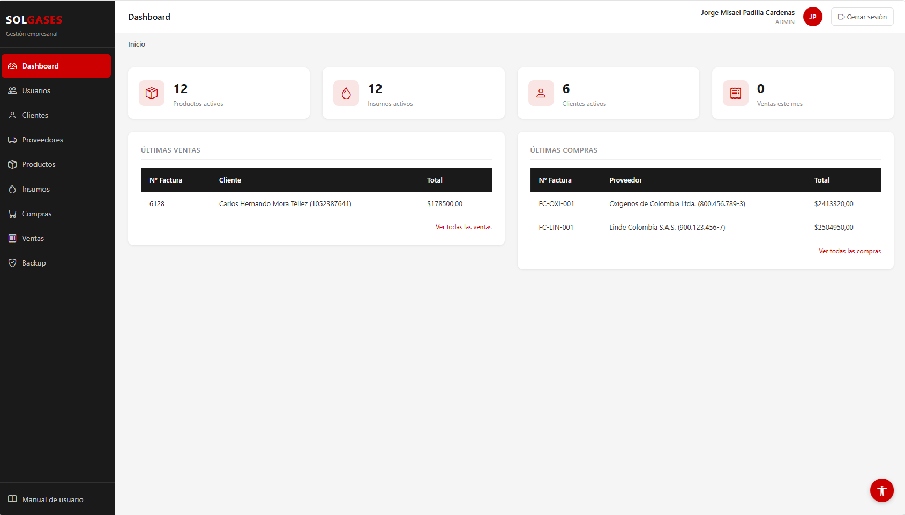
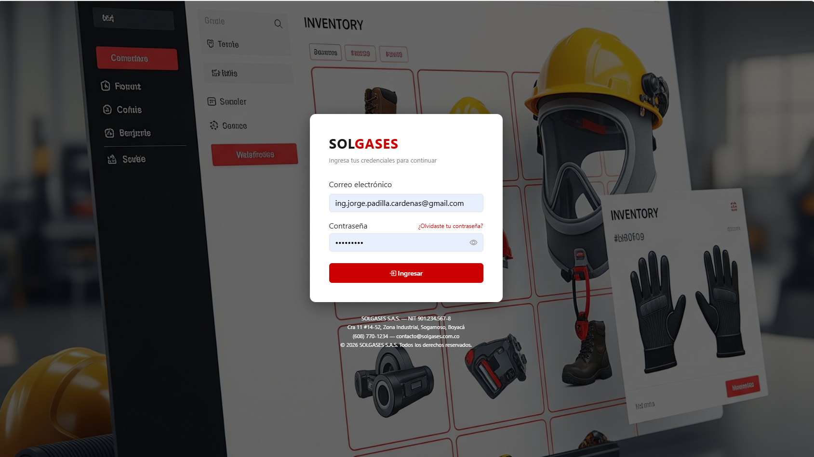
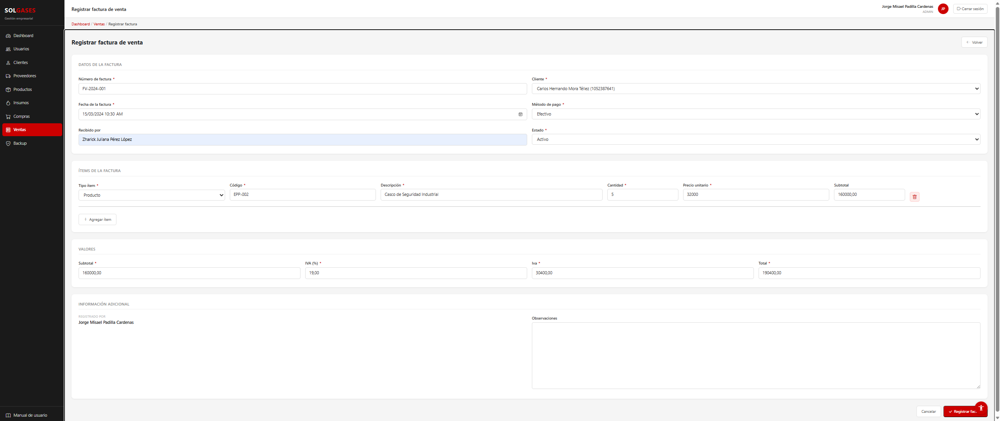
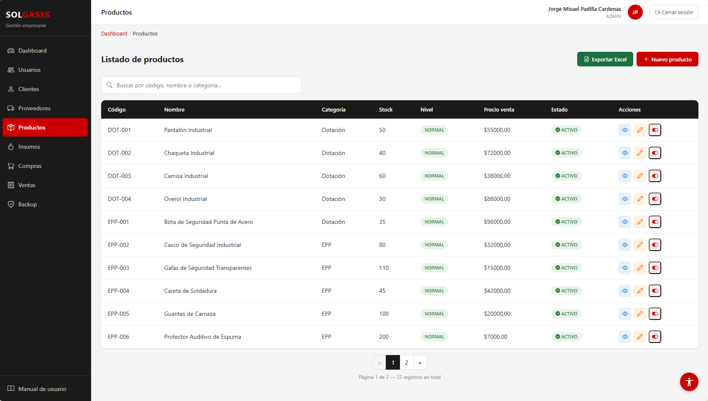

# SOLGASES — Sistema de Gestión Empresarial

<p align="center">
  
</p>

<p align="center">
  
  
  
  
  
  
</p>

<p align="center">
  <a href="#español">🇨🇴 Español</a> &nbsp;|&nbsp; <a href="#english">🇺🇸 English</a>
</p>

---

<a name="español"></a>
## 🇨🇴 Español

### ¿Qué es SOLGASES?

Plataforma web de gestión empresarial desarrollada con Django 6 para una distribuidora de gases industriales. Centraliza la administración de inventario, facturación de compras y ventas, control de stock, auditoría de cambios y copias de seguridad automáticas en una sola interfaz segura y accesible.

### ¿Por qué existe?

La empresa gestionaba su inventario, facturas y clientes en hojas de cálculo independientes. Eso generaba errores de stock, pérdida de trazabilidad y duplicación de datos. SOLGASES reemplaza ese flujo con un sistema web que actualiza el stock automáticamente al registrar cada compra o venta, registra quién hizo qué y cuándo, y genera reportes en PDF y Excel con un clic.

---

### Capturas del sistema

<p align="center">
  
  <br><em>Pantalla de acceso con autenticación segura</em>
</p>

<p align="center">
  
  <br><em>Dashboard con métricas en tiempo real y últimas transacciones</em>
</p>

<p align="center">
  
  <br><em>Formulario de venta — descuenta stock automáticamente con validación y cálculo de IVA</em>
</p>

<p align="center">
  
  <br><em>Listado con búsqueda en tiempo real, paginación y exportación a Excel</em>
</p>

---

### Características principales

- **Control de stock automático** — cada compra suma stock y cada venta lo descuenta con validación; si no hay suficiente, la operación se revierte completamente (transacción atómica)
- **Facturación completa** — facturas de compra y venta con detalles de línea, cálculo automático de IVA y totales
- **Auditoría exhaustiva** — cada cambio registra quién lo hizo, cuándo y con qué observación
- **Exportación de reportes** — PDF y Excel desde cualquier listado
- **Backups automáticos** — copia de seguridad diaria programada con APScheduler; retención configurable
- **Roles y permisos** — ADMIN con acceso total, EMP con acceso de lectura y registro
- **Seguridad empresarial** — protección contra fuerza bruta, CSP, HSTS, sesiones con expiración
- **Accesibilidad WCAG 2.1** — ajuste de letra, alto contraste y modo daltonismo

---

### Módulos

| Módulo | Descripción |
|---|---|
| `core` | Autenticación, dashboard, recuperación de contraseña |
| `usuarios` | Gestión de usuarios del sistema, clientes y proveedores |
| `productos` | Catálogo de productos (dotación y EPP) con control de stock |
| `insumos` | Catálogo de gases industriales e insumos con control de stock |
| `compras` | Registro de facturas de compra — actualiza stock automáticamente |
| `ventas` | Registro de facturas de venta — descuenta stock con validación |
| `backup` | Copias de seguridad manuales y automáticas de la base de datos |

---

### Stack tecnológico

| Componente | Tecnología |
|---|---|
| Backend | Django 6.0.3 + Python 3.13 |
| Base de datos | MySQL 8.0+ (mysqlclient 2.2.8) |
| Frontend | Bootstrap 5.3 + Bootstrap Icons 1.11 |
| Seguridad | django-axes 8.3.1 + django-csp 4.0 |
| Variables de entorno | django-environ 0.13.0 |
| Tareas programadas | APScheduler 3.11.2 + django-apscheduler 0.7.0 |
| Reportes | openpyxl 3.1.5 (Excel) + xhtml2pdf 0.2.17 (PDF) |
| Imágenes | Pillow 12.2.0 |

---

### Decisiones técnicas

| Decisión | Razonamiento |
|---|---|
| **Custom User Model con email** | El sistema autentica por correo, no por username. Cambiar el modelo de auth después de crear tablas es costoso — se definió desde el inicio |
| **Decimal en campos monetarios** | `FloatField` acumula errores de precisión en operaciones financieras. `DecimalField` garantiza exactitud en precios e IVA |
| **Transacciones atómicas en ventas/compras** | Si el descuento de stock falla a mitad de la operación, `transaction.atomic()` revierte todo — nunca queda el stock en estado inconsistente |
| **IVA almacenado como dato** | Guardar el porcentaje y el monto en cada factura permite auditoría fiscal histórica aunque la tasa cambie en el futuro |
| **SimpleTestCase para propiedades calculadas** | `nivel_stock` es lógica pura sin acceso a BD — usar `SimpleTestCase` es más preciso y 1000x más rápido que `TestCase` |

---

### Tests

El proyecto incluye una suite de **51 tests** que cubren la lógica de negocio crítica:

```bash
python manage.py test apps.ventas apps.compras apps.productos apps.insumos apps.usuarios
```

```
Ran 51 tests in 9.1s — OK
```

| Módulo | Tests | Qué verifica |
|---|---|---|
| `ventas` | 14 | Descuento de stock, stock insuficiente, rollback atómico |
| `compras` | 12 | Suma de stock, actualización de precio, auto-creación de ítems |
| `productos` | 8 | `nivel_stock` — 3 estados y 4 valores de frontera |
| `insumos` | 7 | `nivel_stock` — 3 estados y fronteras |
| `usuarios` | 10 | Custom manager, hash de contraseña, representación textual |

---

### Instalación rápida

```bash
# 1. Clonar el repositorio
git clone https://github.com/<tu-usuario>/solgases.git
cd solgases

# 2. Crear y activar entorno virtual
python -m venv venv
venv\Scripts\activate          # Windows
source venv/bin/activate       # Linux / macOS

# 3. Instalar dependencias
pip install -r requirements.txt

# 4. Configurar variables de entorno
cp .env.example .env           # editar con tus credenciales MySQL

# 5. Aplicar migraciones y crear superusuario
python manage.py migrate
python manage.py createsuperuser

# 6. Ejecutar el servidor
python manage.py runserver
```

Acceder en: `http://127.0.0.1:8000`

---

### Configuración del entorno

Crear el archivo `.env` en la raíz del proyecto:

```env
SECRET_KEY=cambiar-por-clave-secreta-segura
DEBUG=True
ALLOWED_HOSTS=127.0.0.1,localhost

DB_NAME=solgases_db
DB_USER=root
DB_PASSWORD=tu_password
DB_HOST=127.0.0.1
DB_PORT=3306

# Solo para producción (dejar vacío en desarrollo)
EMAIL_HOST_USER=
EMAIL_HOST_PASSWORD=
```

> En desarrollo el sistema usa `ConsoleEmailBackend` — los correos se muestran en la terminal.
> En producción, completar las variables de email para activar Gmail SMTP.

### Base de datos

```bash
mysql -u root -p -e "CREATE DATABASE solgases_db CHARACTER SET utf8mb4 COLLATE utf8mb4_unicode_ci;"
python manage.py migrate
```

---

### Estructura del proyecto

```
solgases/
├── apps/
│   ├── core/           # Login, dashboard, recuperación contraseña
│   ├── usuarios/       # Usuarios, clientes, proveedores
│   ├── productos/      # Catálogo de productos y stock
│   ├── insumos/        # Catálogo de insumos y stock
│   ├── compras/        # Facturas de compra
│   ├── ventas/         # Facturas de venta
│   └── backup/         # Copias de seguridad
├── config/
│   ├── settings.py     # Configuración principal
│   └── urls.py         # URLs raíz
├── docs/
│   └── images/         # Capturas del sistema para documentación
├── static/
│   ├── css/            # solgases.css — hoja de estilos
│   ├── js/             # Búsqueda, formset dinámico, cálculo IVA, accesibilidad
│   └── img/            # Logo y recursos gráficos
├── templates/
│   ├── base.html       # Template base con sidebar y navegación
│   ├── partials/       # Componentes reutilizables
│   └── <módulo>/       # Templates por módulo
├── .env                # Variables de entorno (excluido de git)
├── manage.py
└── requirements.txt
```

---

### Roles y permisos

| Rol | Acceso |
|---|---|
| **ADMIN** | Acceso completo — crear, editar, activar/desactivar, exportar |
| **EMP** (Empleado) | Lectura y registro — sin eliminación ni configuración |

La matriz de permisos completa está disponible en el **Manual del sistema** en `/manual/`.

---

### Seguridad

- Protección contra fuerza bruta con `django-axes` (bloqueo tras 5 intentos, 15 min)
- Content Security Policy activa (`django-csp`) — sin inline scripts
- Sesiones con expiración automática (1 hora de inactividad)
- HTTPS, HSTS y cabeceras de seguridad en producción (`DEBUG=False`)
- Variables de entorno con `django-environ` — sin credenciales en el código

---

### Accesibilidad

Widget flotante (esquina inferior derecha) con:

- Ajuste de tamaño de letra (8px – 20px)
- Modo alto contraste
- Modo daltonismo (escala de grises)

Cumple criterios WCAG 2.1: SC 1.4.1, 1.4.11, 2.4.1, 4.1.2.

---

### Autor

**Jorge Misael Padilla Cárdenas**
Desarrollador Backend — Django · Python · MySQL

- GitHub: [@<tu-usuario>](https://github.com/<tu-usuario>)
- LinkedIn: [linkedin.com/in/<tu-perfil>](https://linkedin.com/in/<tu-perfil>)
- Email: ing.jorge.padilla.cardenas@gmail.com

---

<a name="english"></a>
## 🇺🇸 English

### What is SOLGASES?

A web-based business management platform built with Django 6 for an industrial gas distribution company. It centralizes inventory management, purchase and sales invoicing, stock control, change auditing, and automatic database backups in a single secure and accessible interface.

### Why does it exist?

The company managed inventory, invoices, and clients across separate spreadsheets — causing stock errors, lost traceability, and duplicated data. SOLGASES replaces that workflow with a web system that automatically updates stock on every purchase or sale, logs who did what and when, and generates PDF and Excel reports in one click.

---

### Screenshots

<p align="center">
  
  <br><em>Secure authentication screen</em>
</p>

<p align="center">
  
  <br><em>Dashboard with real-time metrics and latest transactions</em>
</p>

<p align="center">
  
  <br><em>Sales form — automatically deducts stock with validation and VAT calculation</em>
</p>

<p align="center">
  
  <br><em>Listing with real-time search, pagination, and Excel export</em>
</p>

---

### Key Features

- **Automatic stock control** — purchases add stock, sales deduct it with validation; if insufficient, the entire operation rolls back (atomic transaction)
- **Full invoicing** — purchase and sales invoices with line items, automatic VAT and total calculation
- **Exhaustive audit trail** — every change records who, when, and with what observation
- **Report export** — PDF and Excel from any listing
- **Automatic backups** — daily scheduled backup via APScheduler; configurable retention
- **Role-based access** — ADMIN with full access, EMP with read and record access
- **Enterprise security** — brute-force protection, CSP, HSTS, session expiration
- **WCAG 2.1 Accessibility** — font size, high contrast, and colorblind mode

---

### Modules

| Module | Description |
|---|---|
| `core` | Authentication, dashboard, password recovery |
| `usuarios` | System users, customers, and supplier management |
| `productos` | Product catalog (PPE and workwear) with stock control |
| `insumos` | Industrial gas and supply catalog with stock control |
| `compras` | Purchase invoice recording — automatically updates stock |
| `ventas` | Sales invoice recording — stock deduction with validation |
| `backup` | Manual and automatic database backups |

---

### Tech Stack

| Component | Technology |
|---|---|
| Backend | Django 6.0.3 + Python 3.13 |
| Database | MySQL 8.0+ (mysqlclient 2.2.8) |
| Frontend | Bootstrap 5.3 + Bootstrap Icons 1.11 |
| Security | django-axes 8.3.1 + django-csp 4.0 |
| Environment | django-environ 0.13.0 |
| Scheduler | APScheduler 3.11.2 + django-apscheduler 0.7.0 |
| Reports | openpyxl 3.1.5 (Excel) + xhtml2pdf 0.2.17 (PDF) |
| Images | Pillow 12.2.0 |

---

### Technical Decisions

| Decision | Reasoning |
|---|---|
| **Custom User Model with email** | The system authenticates by email, not username. Changing the auth model after creating tables is costly — defined from the start |
| **Decimal fields for money** | `FloatField` accumulates precision errors in financial operations. `DecimalField` guarantees accuracy for prices and VAT |
| **Atomic transactions on sales/purchases** | If stock deduction fails mid-operation, `transaction.atomic()` rolls everything back — stock never ends up in an inconsistent state |
| **VAT stored as data** | Saving the percentage and amount on each invoice enables historical fiscal audit even if the tax rate changes in the future |
| **SimpleTestCase for calculated properties** | `nivel_stock` is pure logic with no DB access — using `SimpleTestCase` is more precise and 1000x faster than `TestCase` |

---

### Tests

The project includes **51 tests** covering critical business logic:

```bash
python manage.py test apps.ventas apps.compras apps.productos apps.insumos apps.usuarios
```

```
Ran 51 tests in 9.1s — OK
```

| Module | Tests | What it verifies |
|---|---|---|
| `ventas` | 14 | Stock deduction, insufficient stock, atomic rollback |
| `compras` | 12 | Stock increment, price update, auto-creation of items |
| `productos` | 8 | `nivel_stock` — 3 states and 4 boundary values |
| `insumos` | 7 | `nivel_stock` — 3 states and boundaries |
| `usuarios` | 10 | Custom manager, password hashing, string representation |

---

### Quick Start

```bash
# 1. Clone the repository
git clone https://github.com/<your-username>/solgases.git
cd solgases

# 2. Create and activate virtual environment
python -m venv venv
venv\Scripts\activate          # Windows
source venv/bin/activate       # Linux / macOS

# 3. Install dependencies
pip install -r requirements.txt

# 4. Configure environment variables
cp .env.example .env           # edit with your MySQL credentials

# 5. Apply migrations and create superuser
python manage.py migrate
python manage.py createsuperuser

# 6. Run the server
python manage.py runserver
```

Open in browser: `http://127.0.0.1:8000`

---

### Environment Configuration

Create a `.env` file in the project root:

```env
SECRET_KEY=change-to-a-secure-secret-key
DEBUG=True
ALLOWED_HOSTS=127.0.0.1,localhost

DB_NAME=solgases_db
DB_USER=root
DB_PASSWORD=your_password
DB_HOST=127.0.0.1
DB_PORT=3306

# Production only (leave empty in development)
EMAIL_HOST_USER=
EMAIL_HOST_PASSWORD=
```

> In development, the system uses `ConsoleEmailBackend` — emails are printed to the terminal.
> In production, fill in the email variables to enable Gmail SMTP.

---

### Roles and Permissions

| Role | Access |
|---|---|
| **ADMIN** | Full access — create, edit, activate/deactivate, export |
| **EMP** (Employee) | Read and record — no deletion or configuration |

The full permissions matrix is available in the **System Manual** at `/manual/`.

---

### Security

- Brute-force protection via `django-axes` (lockout after 5 attempts, 15 min cooldown)
- Active Content Security Policy (`django-csp`) — no inline scripts
- Session expiration (1 hour of inactivity)
- HTTPS, HSTS, and security headers in production (`DEBUG=False`)
- Environment variables via `django-environ` — no credentials in source code

---

### Accessibility

Floating widget (bottom-right corner) with:

- Font size adjustment (8px – 20px)
- High contrast mode
- Colorblind mode (grayscale)

Complies with WCAG 2.1 criteria: SC 1.4.1, 1.4.11, 2.4.1, 4.1.2.

---

### Author

**Jorge Misael Padilla Cárdenas**
Backend Developer — Django · Python · MySQL

- GitHub: [@<your-username>](https://github.com/<your-username>)
- LinkedIn: [linkedin.com/in/<your-profile>](https://linkedin.com/in/<your-profile>)
- Email: ing.jorge.padilla.cardenas@gmail.com
